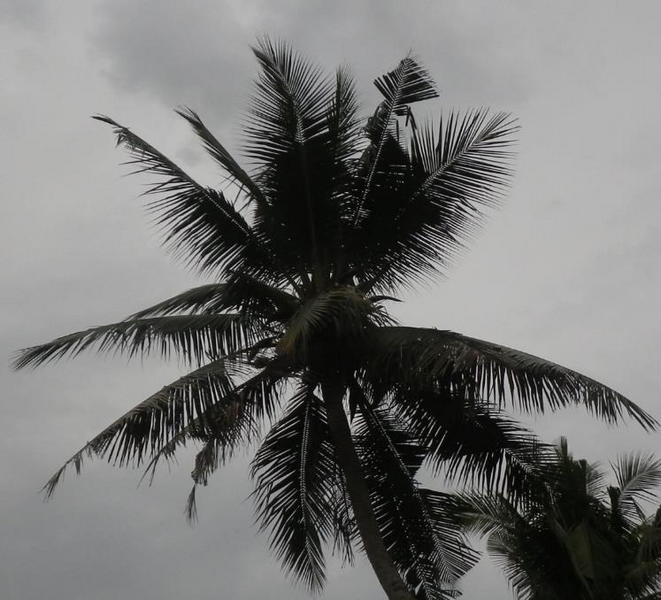

# Figures List

## Fig. 1	

File name: rhino_beetle_head.jpg

## Fig. 2	

File name: crb_life_cycle.png

## Fig. 3	

File name: dying_coconuts.jpeg

## Fig. 4	

File name: vshaped-cuts.png

## Fig. 5	

File name: bore-hole-through-petiole.png

## Fig. 6	

File name: bore-hole.png

## Fig. 7	

File name: crb_dist.png

## Fig. 8	

File name: hoyt-trap.png

## Fig. 9	

File name: log-trap.png

## Fig. 10	

File name: spc-bucket.png

## Fig. 11	

File name: uog-bucket.png

## Fig. 12	

File name: panel-trap.png

## Fig. 13	

File name: tekken-beetle.png

## Fig. 14	

File name: tekken-pile.png

## Fig. 15A	

File name: defence-trap.png

## Fig. 15B	

File name: defence-trap-lure.png

## Fig. 16

File name: j5index0.resized.png

## Fig. 17

File name: j5index1.resized.png

## Fig. 18

File name: j5index2.resized.png

## Fig. 19

File name: j5index3.resized.png

## Fig. 20

File name: j5index4.resized.png

